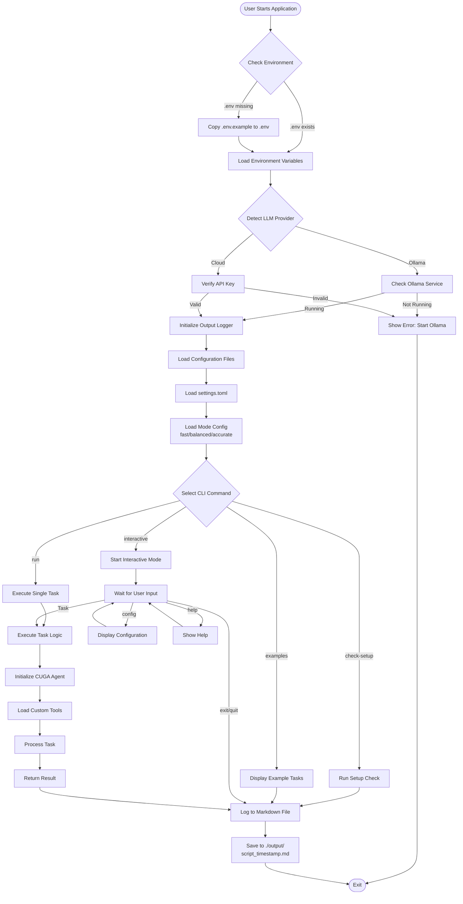
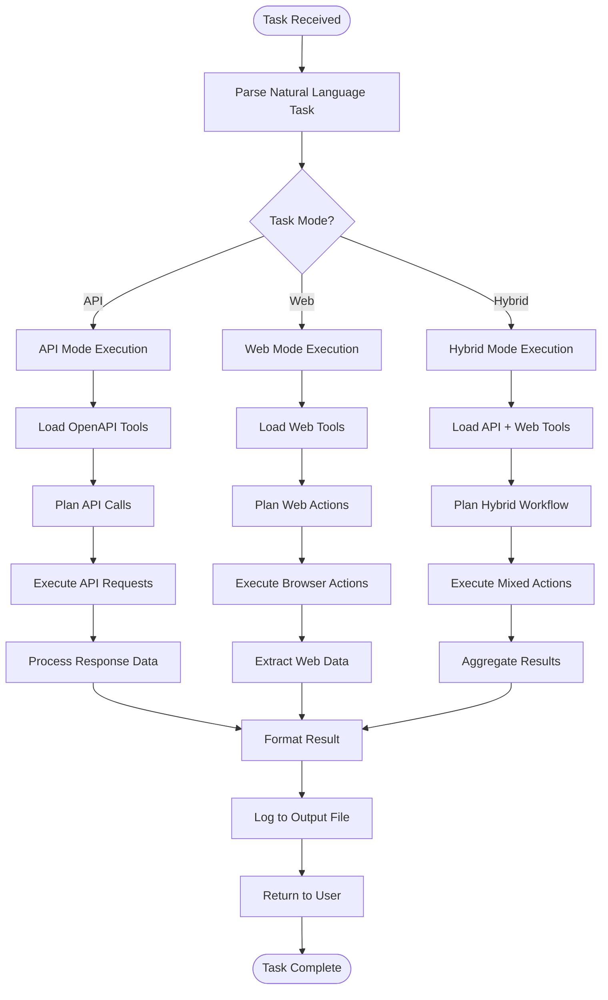
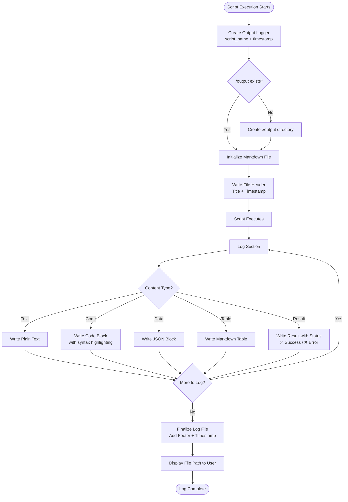
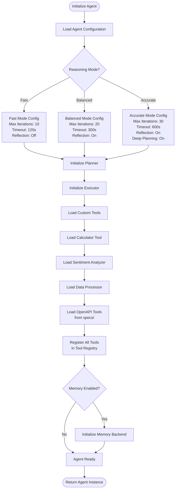
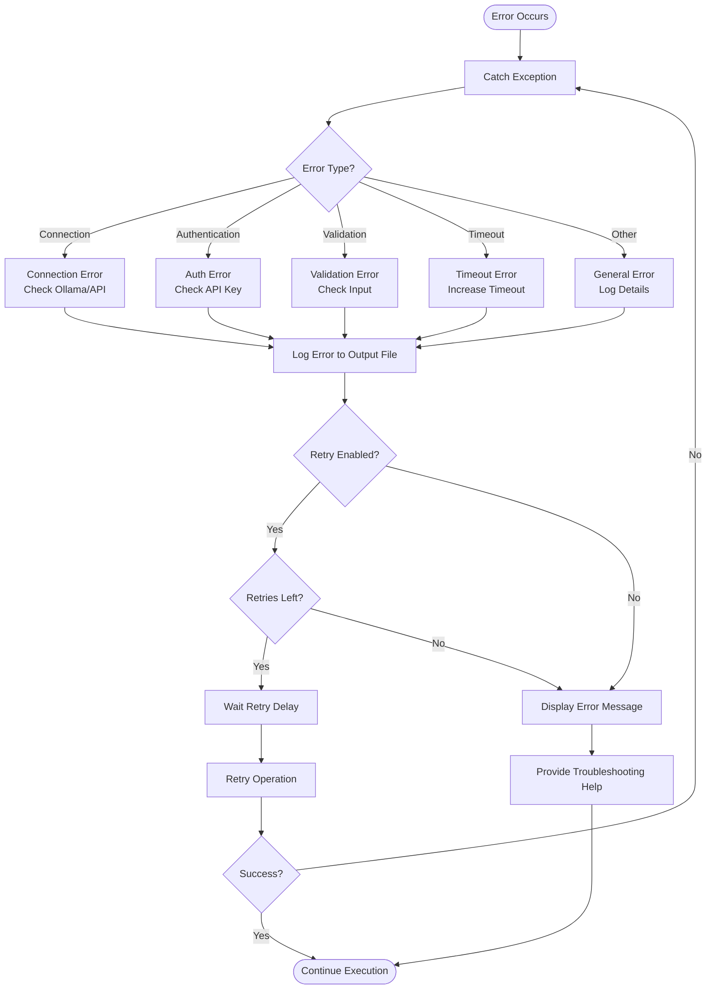
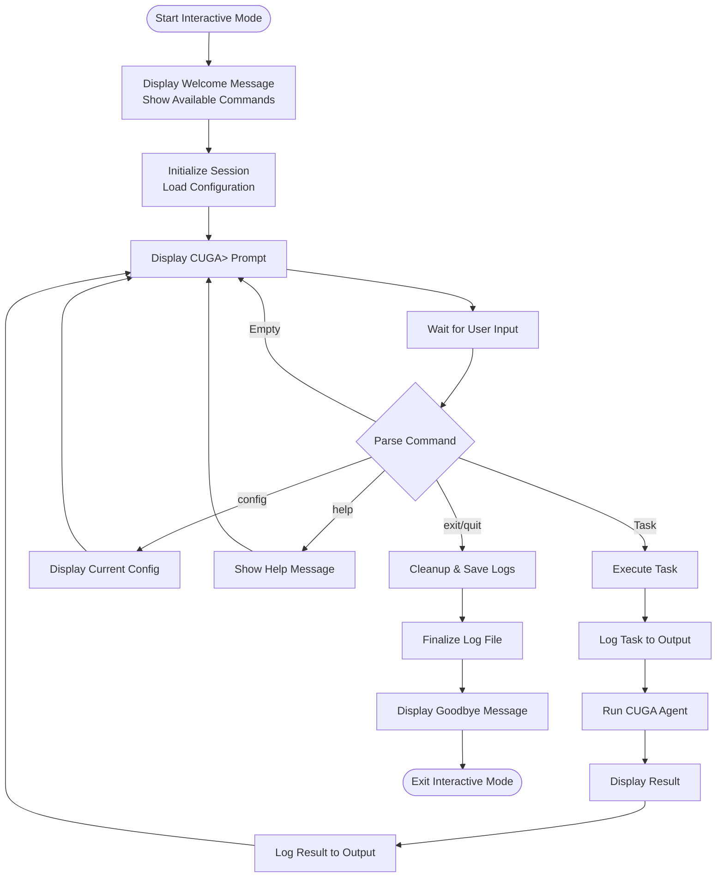
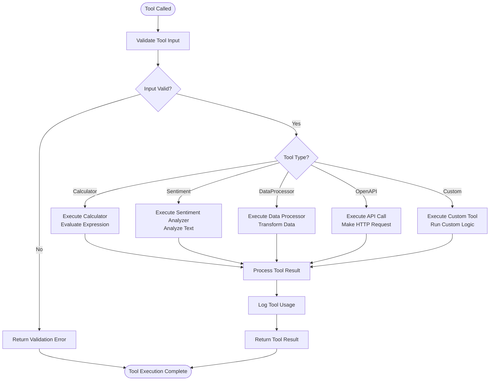

# CUGA Demo Application - Architecture Flowchart

This document provides a visual representation of the application's logic flow using Mermaid diagrams.

## Overall Application Flow



## Task Execution Flow



## Configuration Loading Flow

```mermaid
flowchart TD
    ConfigStart([Load Configuration]) --> LoadEnvVars[Load .env Variables]
    LoadEnvVars --> CheckProvider{Provider Type?}
    
    CheckProvider -->|Ollama| SetOllama[Set Ollama Config<br/>API Key: ollama<br/>Base URL: localhost:11434]
    CheckProvider -->|OpenAI| SetOpenAI[Set OpenAI Config<br/>API Key from env<br/>Model: gpt-4o]
    CheckProvider -->|watsonx| SetWatsonx[Set watsonx Config<br/>API Key + Project ID]
    CheckProvider -->|Azure| SetAzure[Set Azure Config<br/>Endpoint + API Key]
    CheckProvider -->|OpenRouter| SetOpenRouter[Set OpenRouter Config<br/>API Key + Base URL]
    
    SetOllama --> LoadMainConfig[Load settings.toml]
    SetOpenAI --> LoadMainConfig
    SetWatsonx --> LoadMainConfig
    SetAzure --> LoadMainConfig
    SetOpenRouter --> LoadMainConfig
    
    LoadMainConfig --> ParseFeatures[Parse Features Section]
    ParseFeatures --> GetMode[Get CUGA Mode<br/>fast/balanced/accurate]
    GetMode --> LoadModeConfig[Load Mode-Specific Config<br/>modes/{mode}.toml]
    
    LoadModeConfig --> MergeConfigs[Merge Configurations]
    MergeConfigs --> LoadToolRegistry[Load Tool Registry<br/>tools/mcp_servers.yaml]
    LoadToolRegistry --> ConfigReady[Configuration Ready]
    ConfigReady --> ConfigEnd([Return Config Object])
```

## Output Logger Flow



## Agent Initialization Flow



## Error Handling Flow



## Interactive Mode Flow



## Tool Execution Flow



---

## Legend

- **Rectangles**: Process/Action steps
- **Diamonds**: Decision points
- **Rounded Rectangles**: Start/End points
- **Parallelograms**: Input/Output operations

## Notes

1. All flows include automatic output logging to `./output/` directory
2. Error handling is integrated at every major step
3. Configuration is loaded once at startup and cached
4. Tools are registered dynamically based on configuration
5. Interactive mode maintains session state throughout execution

---

*Generated for CUGA Demo Application*  
*Last Updated: December 17, 2024*